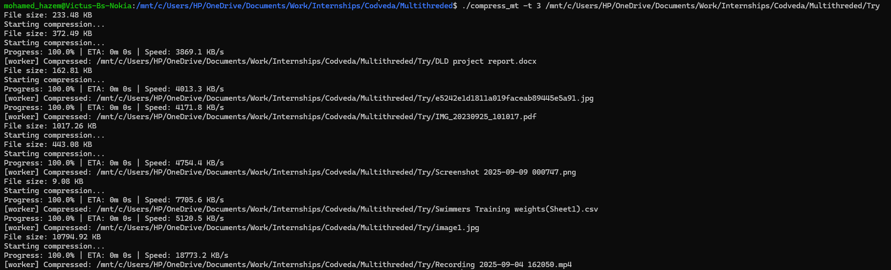
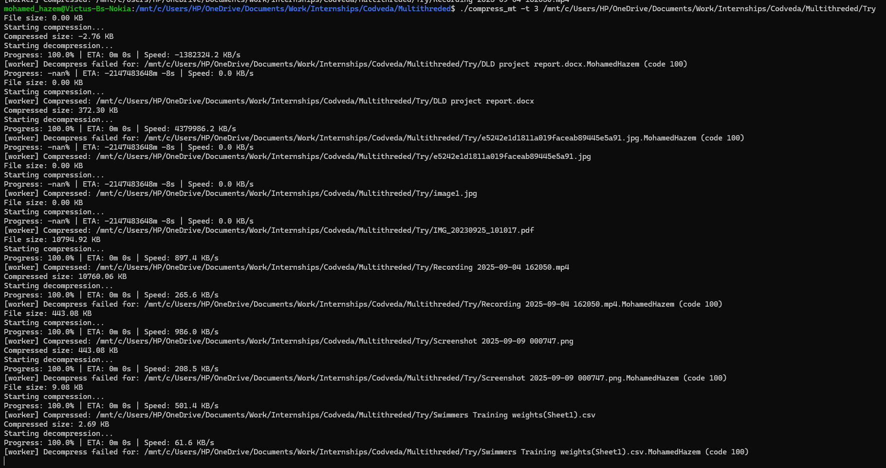
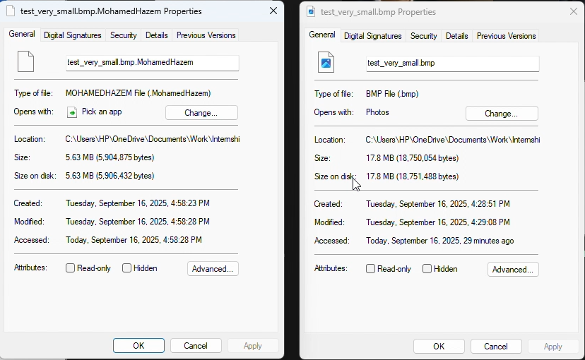

# 📦 Multithreaded File Compression & Decompression Tool

A high-performance, multithreaded file compression and decompression tool built in modern C++17 using Huffman coding for efficient, lossless data compression.

This project showcases advanced programming concepts including multithreading, data structures, and system-level optimization, delivering a real-world utility that is both fast and scalable.

---
## 🖼️ Screenshots

### Compression in Action


### Decompression in Action


### Compression Ratio


---

## 🚀 Key Features

⚡ **Multithreaded Compression**  
Compress multiple files in parallel, drastically reducing time for directories with large files.

📦 **Adaptive Block Processing**  
Configurable block sizes for memory efficiency and balanced trade-off between speed and compression ratio.

🌲 **Huffman Coding**  
- Custom Huffman tree for encoding/decoding  
- Optimized hash map for fast decompression lookups  

📊 **Real-Time Progress Feedback**  
Live progress bar with speed (KB/s) and estimated time remaining.

📝 **Automatic File Extension Handling**  
- Compressed files use `.MohamedHazem` extension  
- Automatically detects whether to compress or decompress  

🖥️ **Cross-Platform Friendly**  
Works seamlessly on Linux, WSL, and other Unix-like systems with POSIX threads support.

⚙️ **Highly Customizable**  
- Adjust number of threads  
- Tune block sizes via CLI arguments  

📂 **Directory Support**  
Recursively compress entire folders with multithreaded efficiency.
## 🌟 Why This Project Stands Out

♠️ Demonstrates low-level C++ mastery with threads, synchronization, and system calls.  
♥️ Implements real-world algorithms (Huffman tree, hash maps) for maximum performance.  
♦️ Provides interactive user experience with progress tracking (rare in basic compressors).  
♣️ Scalable: works on small text files, massive datasets, and full directories.  
## 🔧 Build Instructions

```bash
# Clone the repository
git clone https://github.com/The-Mastermind-of-this-gen/compression-tool.git
cd compression-tool

# Build (requires g++ with C++17 and pthread support)
g++ -std=c++17 -pthread -O2 main.cpp -o compressor
```
##📖 Usage

```bash
# Compress a file
./compressor file.txt

# Decompress a file
./compressor file.txt.MohamedHazem

# Compress entire directory with 8 threads & 1MB blocks
./compressor my_folder -t 8 -b 1048576
```
## ⚙️ Command-Line Options

- `-t <threads>` → Number of threads (**default:** 4)  
- `-b <block_size>` → Block size in bytes (**default:** 65536)  

✅ Accepts both files and directories.  
## 📊 Example Output

[###------] 42% | Speed: 512 KB/s | ETA: 00:13


## 📂 Project Structure

| Path / Folder      | Description |
|--------------------|-------------|
| `Multithreaded/`   | Main source directory |
| ├── `multithread_driver.cpp` | Driver program for multithreaded execution |
| ├── `compress_mt`            | Executable for multithreaded compression |
| ├── `compressor.cpp`         | Core compression logic |
| ├── `compressor.h`           | Header file for compressor class |
| ├── `compressor_impl.cpp`    | Implementation details of compressor |
| ├── `HashMap.h`              | Custom hash map implementation |
| ├── `Heap.h`                 | Heap data structure for Huffman coding |
| ├── `HuffmanTree.h`          | Huffman tree structure and algorithms |
| `README.md`        | Project documentation |


## 🛠️ Technologies Used

- **C++17** → modern features, smart pointers, STL  
- **POSIX Threads (pthreads)** → multithreading support  
- **Huffman Coding** → data compression algorithm  


## 🧑‍💻 Author

👋 **Mohamed Hazem Tawfik**  
_First Rank Holder, Computer Engineer at Arab Academy for Science, Technology & Maritime Transport_  
🔗 [GitHub Profile – The-Mastermind-of-this-gen](https://github.com/The-Mastermind-of-this-gen)

## ⭐ Contributing

Contributions are welcome! Please feel free to **fork** the repository and submit a **pull request**.
